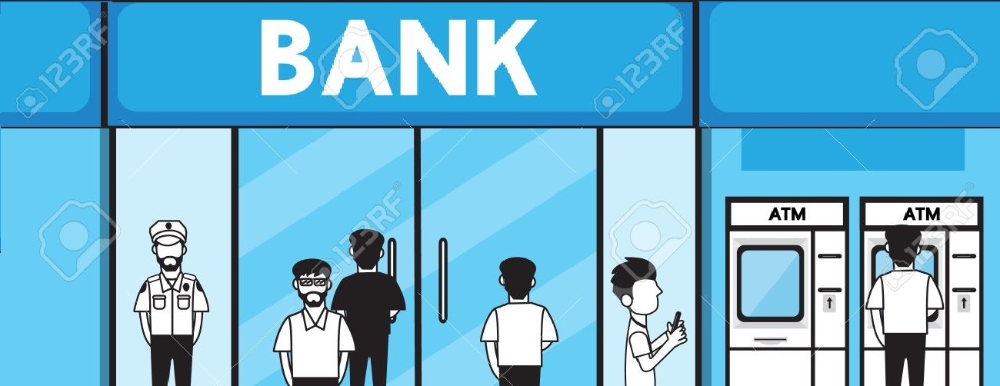

<p align='justify'>
<h1 style="display: inline-block;">BANK SIMULATOR</h1>, es un aplicativo web el cual como lo dice el titulo simula las diferentes transacciones que uno puede realizarlo de manera fisica en un banco. Aparte puedes loguearte con tus datos bancarios para que puedas consultar su informacion bancario como el estado de cuenta, lista de movimientos y realizar transferencias de dinero a otras personas.
</p>

Link del proyecto: [http://localhost:3006](http://localhost:3006)

## Tecnologías

Asegúrate de tener las siguientes tecnologías y dependencias antes de ejecutar el proyecto:

- 
- 
- 
- 
- 

## Instalación

### Getting Started

> Para implementar su aplicación localmente, debe seguir los pasos a continuación.
>
> > Clonar el repositorio

```sh
 git clone https://github.com/juanRCoder/Bank-Simulator.git
```

> > Instalar el paquete de modules (npm)

```sh
 npm install
```

> > Visualizar la app

```sh
 npm  start
```

## Screenshots del proyecto
## Diagrama de flujo

<div align="center">
  
</div>


## Contactos
#### Juan Ramirez
<p>Linkedin : [@juan Ramirez](https://www.linkedin.com/injuan-ramirez-490b84271/)</p>
<p>Instagram : [@juanrcoder](https://www.instagram.com/juanrcoder/)</p>

#### Oscar Morales
<p>Linkedin: [@Oskar Morales](https://www.linkedin.com/in/oskarmorales/)</p>
<p>Github: [0skarmp](https://github.com/0skarmp)</p>

Link del proyecto: [http://localhost:3006](http://localhost:3006)

## Licence
- Este proyecto está bajo la Licencia MIT - ver el archivo [LICENSE](LICENSE) para más detalles.
- Creacion del proyecto 26-01-2024
